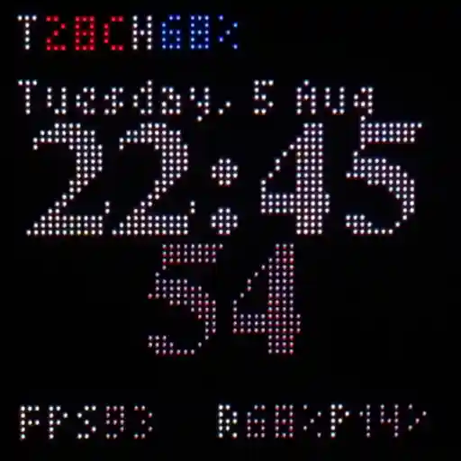
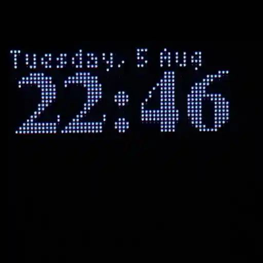

# ESP32-S3 Clock with animations

An ESP32-S3 project for controlling a HUB75 LED matrix panel, connected to WiFi, synchronized via NTP, publishing sensor data and receiving commands via MQTT.

| Clock                            | Night Clock                      |
| -------------------------------- | -------------------------------- |
|  |  |

## Features

-  **HUB75 LED Matrix Panel**: 64x64 RGB LED panel driven via [ESP32-HUB75-MatrixPanel-DMA](https://github.com/mrcodetastic/ESP32-HUB75-MatrixPanel-DMA) library.
-  **Animated GIF Support**: Loads and plays categorized GIF animations from LittleFS Flash.
-  **NTP Time Sync**: Accurate real-time clock synced via NTP.
-  **DHT22 Temperature & Humidity Sensor**: Displays live sensor readings and upload via MQTT.
-  **MQTT Integration**: Control brightness, animations, power saving, and more remotely.

## Requirements

-  ESP32-S3 development board (PSRAM required for gifs)
-  HUB75 64x64 LED matrix panel
-  DHT22 temperature/humidity sensor
-  WiFi network
-  MQTT broker (with TLS support recommended)
-  Home Assistant for management
